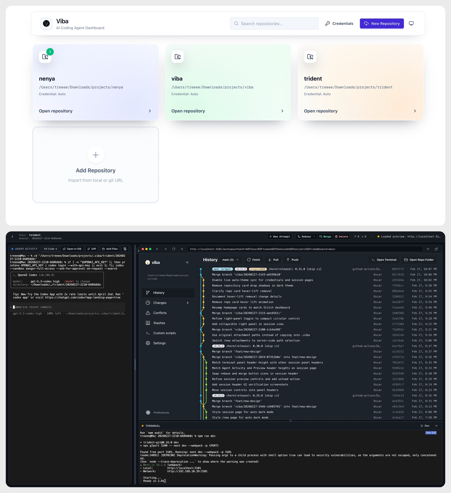

# Palx

Palx is a local session manager for AI coding agents. It lets you pick a Git repository, start an isolated worktree session, launch an agent CLI in a browser terminal, and manage the session lifecycle from one UI.




## Major Features

- **Isolated Sessions**: Uses `git worktree` to create clean, isolated environments for every task, with automatic per-session branch naming (`palx/<session>`).
- **New Attempt Flow**: Start new sessions pre-filled with context (title, model, prompt, attachments) from any previous session to iterate quickly.
- **Enhanced File Browser**:
  - **Grid & List Views**: Browse files with rich thumbnails or a compact list.
  - **Pinned Shortcuts**: Pin frequently used directories for quick navigation across session restarts.
  - **Clipboard Paste**: Quickly add attachments by pasting files or images directly into the browser.
  - **@ Mention Suggestions**: Intelligent file path suggestions from your tracked repository files.
- **Dual Terminal Workspace**:
  - Left terminal for agent execution.
  - Right terminal for startup/dev scripts.
- **Session Lifecycle Management**:
  - Real-time Git status (ahead/behind counts, uncommitted changes).
  - One-click **Commit**, **Merge**, and **Rebase** operations.
  - **IDE Deep-links**: Open session worktrees directly in VS Code, Cursor, Windsurf, or Antigravity.
- **Robust Session Resume**: Resume any session with full context, preserving original startup flags and model overrides.
- **Async Operations**: Performance-optimized background tasks like session purging to keep the UI responsive.
- **Multi-Agent Support**: Out-of-the-box support for Codex, Gemini, and Cursor Agent, with a customizable provider/model selector.
- **Persistent Metadata**: Local metadata/config is stored in SQLite at `~/.viba/palx.db` (single-file, portable). Session prompt text files remain under `~/.viba/session-prompts`.

## Tech Stack

- Next.js (App Router) + React + TypeScript
- Tailwind CSS + DaisyUI
- `simple-git` for Git/worktree operations
- `ttyd` + `tmux` as the web terminal backend/persistence layer (proxied at `/terminal`)

## Prerequisites

- Node.js and npm
- A system package manager (`vibe-pal` auto-installs `ttyd` and `tmux` when missing on macOS/Linux, and runs `npx skills add https://github.com/vercel-labs/agent-browser --skill agent-browser --agent codex cursor gemini-cli -g -y` plus `npx skills add https://github.com/obra/superpowers --skill systematic-debugging --agent codex cursor gemini-cli -g -y` for Codex skill provisioning)
- At least one supported agent CLI installed (for example `codex`, `gemini`, or `agent`)

## Getting Started

Install dependencies and start development:

```bash
npm install
npm run dev
```

### Auth0 Authentication

Palx now requires login before accessing the app.

Add these variables to your `.env`:

```bash
AUTH0_DOMAIN=your-tenant.us.auth0.com
AUTH0_CLIENT_ID=your_client_id
AUTH0_CLIENT_SECRET=your_client_secret
AUTH0_SECRET=<openssl rand -hex 32>
APP_BASE_URL=http://localhost:3200
```

- Generate `AUTH0_SECRET` with: `openssl rand -hex 32`
- In Auth0 Application settings, add:
  - Allowed Callback URLs: `http://localhost:3200/auth/callback`
  - Allowed Logout URLs: `http://localhost:3200/auth/logout`
- If any required Auth0 variable is missing, Palx runs in unprotected mode and shows a warning banner on the home page.

The app picks an available port starting at `3200` in development.
Development mode does not auto-open a browser tab; open the printed local URL manually.

Open the local URL printed in your terminal, then:

1. Select a local Git repository.
2. Pick branch/agent/model and optional scripts.
3. Start a session and work inside the generated worktree.

## Run with npx

```bash
npx vibe-pal
```

This starts Palx on an available local port (default `3200`).  
By default, the non-dev launcher opens `http://localhost:<port>` in your default browser once the server is ready.  
Set `BROWSER=none` to disable auto-open.

You can also pass options:

```bash
npx vibe-pal --port 3300
npx vibe-pal --dev
```

Published npm packages are expected to include a prebuilt `.next` output, so `npx vibe-pal` does not build on the end user's machine.

## Build and Run

```bash
npm run build
npm run start
```

Production start uses port `3200` by default.

Useful package scripts:

```bash
npm run cli          # run the packaged launcher locally
npm run pack:preview # preview files that will be published
```
