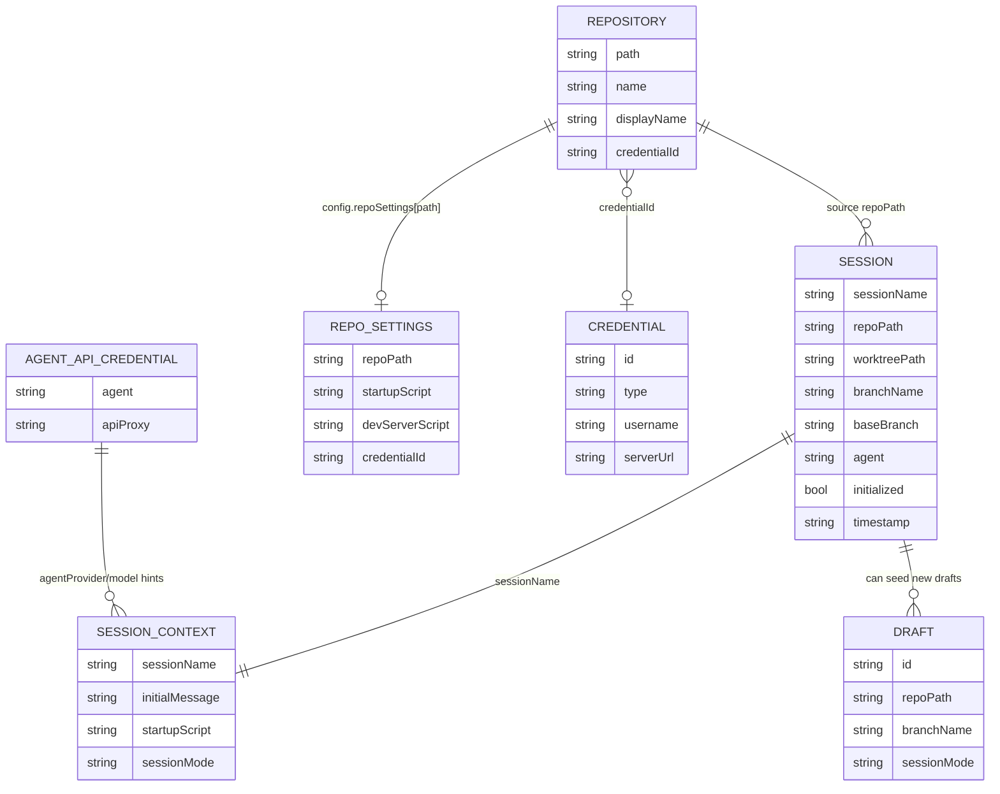

# Data Model

## Persistence Overview

This project has no relational/NoSQL database and no migrations framework.
Persistence is file-based plus OS keychain secrets.

Storage locations used by current code:
- `~/.viba/*` JSON/text files for session/config/draft/credential metadata:
- [src/app/actions/config.ts](../../src/app/actions/config.ts)
- [src/app/actions/session.ts](../../src/app/actions/session.ts)
- [src/app/actions/draft.ts](../../src/app/actions/draft.ts)
- [src/lib/credentials.ts](../../src/lib/credentials.ts)
- [src/lib/agent-api-credentials.ts](../../src/lib/agent-api-credentials.ts)
- Platform app-data directory for repository and settings store (`repos.json`, `settings.json`):
- [src/lib/store.ts](../../src/lib/store.ts)
- [src/lib/platform-utils.ts](../../src/lib/platform-utils.ts)
- OS keychain via `keytar` for credential secret material:
- [src/lib/credentials.ts](../../src/lib/credentials.ts)
- [src/lib/agent-api-credentials.ts](../../src/lib/agent-api-credentials.ts)

## Entities and Schemas

### Repository record
Defined in [src/lib/types.ts](../../src/lib/types.ts) and persisted by [src/lib/store.ts](../../src/lib/store.ts).

Key fields:
- `path`, `name`, optional `displayName`
- `lastOpenedAt`
- `credentialId`
- `customScripts[]`
- tree visibility/expansion fields (`visibilityMap`, `expandedFolders`, etc.)

### App settings (store)
Defined in [src/lib/types.ts](../../src/lib/types.ts), persisted by [src/lib/store.ts](../../src/lib/store.ts).

Key fields:
- `defaultRootFolder`
- `sidebarCollapsed`
- `historyPanelHeight`

### App config (newer config path)
Defined in [src/app/actions/config.ts](../../src/app/actions/config.ts), persisted to `~/.viba/config.json`.

Key fields:
- `recentRepos[]`
- `defaultRoot`
- `selectedIde`
- `agentWidth`
- `repoSettings` map
- `pinnedFolderShortcuts[]`

`repoSettings` entries include:
- `agentProvider`, `agentModel`, `startupScript`, `devServerScript`, `lastBranch`, `credentialId`, `credentialPreference`.

### Session metadata
Defined in [src/app/actions/session.ts](../../src/app/actions/session.ts), persisted as `~/.viba/sessions/<session>.json`.

Key fields:
- `sessionName`
- `repoPath`, `worktreePath`, `branchName`, `baseBranch`
- `agent`, `model`, optional `title`, optional `devServerScript`
- `initialized`
- `timestamp`

### Session launch context
Defined in [src/app/actions/session.ts](../../src/app/actions/session.ts), persisted as `~/.viba/session-contexts/<session>.json`.

Key fields:
- `initialMessage`, `rawInitialMessage`
- `startupScript`
- `attachmentPaths[]`, `attachmentNames[]`
- `agentProvider`, `model`, `sessionMode`, `isResume`

### Draft metadata
Defined in [src/app/actions/draft.ts](../../src/app/actions/draft.ts), persisted as `~/.viba/drafts/<id>.json`.

### Git credential metadata
Defined in [src/lib/credentials.ts](../../src/lib/credentials.ts), persisted to `~/.viba/credentials.json`.

Key fields:
- `id`, `type`, `username`, optional `serverUrl`
- timestamps
- optional `keytarAccount`

Secret value (token) is stored in keychain service `viba-git-credentials`.

### Agent API credential metadata
Defined in [src/lib/agent-api-credentials.ts](../../src/lib/agent-api-credentials.ts), persisted to `~/.viba/agent-api-configs.json`.

Secret value (api key) is stored in keychain service `viba-agent-api-credentials`.

## Relationships

## Concurrency and Consistency Notes

- Most persistence writes are single-file overwrite operations without explicit locking.
- In-memory global maps are used for long-lived processes:
- preview proxy instances (`__vibaPreviewProxyStates`)
- notification socket state (`__vibaSessionNotificationServerState`)
- git client instance cache (`gitInstances` in [src/lib/git.ts](../../src/lib/git.ts)).

## Indexes and Migrations

- No database indexes exist.
- No migration framework exists.
- Some file formats include legacy-shape migration logic at read time:
- credentials legacy object -> array migration in [src/lib/credentials.ts](../../src/lib/credentials.ts)
- agent-api legacy map -> array migration in [src/lib/agent-api-credentials.ts](../../src/lib/agent-api-credentials.ts)

## Gotchas

- Configuration is split across two roots (`getAppDataDir()` vs `~/.viba`).
- Credential metadata may exist without keychain secret if keytar becomes unavailable or secrets were removed; callers handle this by treating token as missing.
