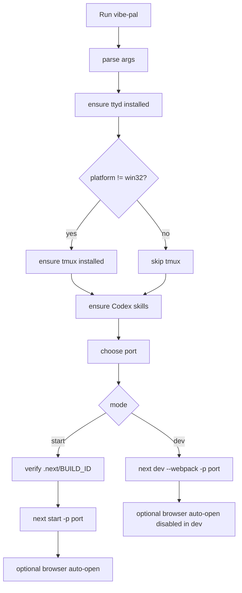

# CLI Launch and Packaging

## What This Feature Does

User-facing behavior:
- Provides `vibe-pal` CLI to run Palx in dev or production mode.
- Auto-detects/installs runtime dependencies (`ttyd`, and `tmux` on non-Windows).
- Auto-opens browser in production mode unless disabled (`BROWSER=none|false|0`).
- Ensures Codex skills are installed globally when missing.

System-facing behavior:
- Finds available port (default `3200`, auto-increment when not explicitly provided).
- Runs Next.js `dev` or `start` with the chosen port.
- Validates prebuilt `.next` output for production launches.

Core files: [bin/viba.mjs](../../../bin/viba.mjs), [src/lib/cli-args.mjs](../../../src/lib/cli-args.mjs), [package.json](../../../package.json).

## Key Modules and Responsibilities

- Argument parsing (`--dev`, `--port`, `--help`): [src/lib/cli-args.mjs](../../../src/lib/cli-args.mjs).
- Launcher orchestration and install strategies: [bin/viba.mjs](../../../bin/viba.mjs).
- npm script entrypoints: [package.json](../../../package.json).
- Publish/release workflows: [.github/workflows/release-on-main-merge.yml](../../../.github/workflows/release-on-main-merge.yml), [.github/workflows/publish-on-tag.yml](../../../.github/workflows/publish-on-tag.yml).

## Public Interfaces

### CLI
- `vibe-pal`
- `vibe-pal --dev`
- `vibe-pal --port <n>` or `-p <n>`
- `vibe-pal --help` / `-h`

### Environment-sensitive behavior
- `PORT`: default/override unless explicit `--port`.
- `BROWSER`: disables auto-open when `none|false|0`.
- `CODEX_HOME`: controls Codex skills install path fallback.

## Data Model and Storage Touches

- No persistent app-domain state is written by launcher directly.
- It may install missing skills globally via `npx skills add ... -g` under agent skill directories:
- `~/.agents/skills`
- `$CODEX_HOME/skills` (or `~/.codex/skills`)

## Main Control Flow

## Error Handling and Edge Cases

- Unknown flags, missing/invalid ports throw explicit argument errors ([src/lib/cli-args.mjs](../../../src/lib/cli-args.mjs)).
- Automatic package-manager installation tries multiple strategies per OS; if all fail, launcher exits with actionable message ([bin/viba.mjs](../../../bin/viba.mjs)).
- Production mode aborts when `.next/BUILD_ID` is missing to enforce prebuilt package expectation ([bin/viba.mjs](../../../bin/viba.mjs)).
- Browser auto-open failure is non-fatal and logs warning.

## Observability

- Launcher logs progress and failures directly to stdout/stderr.
- Release and publish automation runs in GitHub Actions workflows with explicit checks/build steps.

## Tests

- CLI strategy/arg/browser behavior tests: [test/bin/viba.test.mjs](../../../test/bin/viba.test.mjs).
- Arg parser unit tests: [src/lib/cli-args.test.ts](../../../src/lib/cli-args.test.ts).
