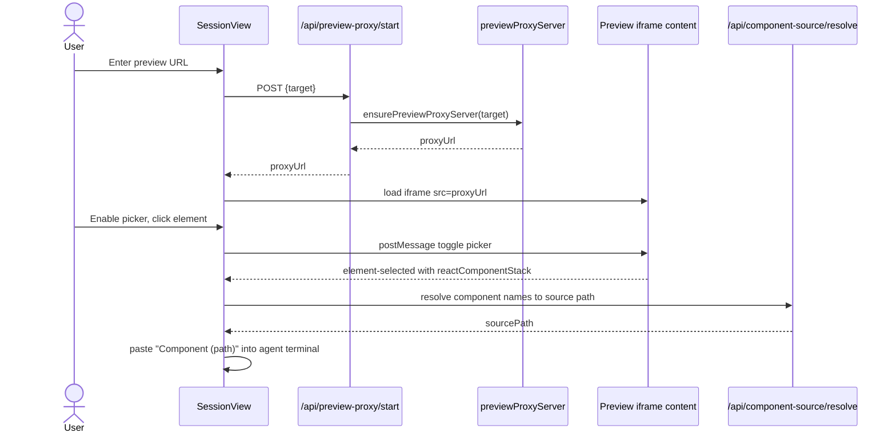

# Preview Proxy and Element Picker

## What This Feature Does

User-facing behavior:
- Loads a running app preview URL into session side panel.
- Enables navigation controls (back/forward/reload) and open-in-new-tab.
- Supports element picker mode to select UI elements and send component identifiers into agent terminal.

System-facing behavior:
- Starts a local HTTP proxy for target origin.
- Injects picker script into HTML responses.
- Bridges iframe messages between parent app and preview content window.
- Resolves selected component names to source file paths via repository scanning API.

## Key Modules and Responsibilities

- Preview proxy lifecycle and injection script:
- [src/lib/previewProxyServer.ts](../../../src/lib/previewProxyServer.ts)
- Start proxy API route:
- [src/app/api/preview-proxy/start/route.ts](../../../src/app/api/preview-proxy/start/route.ts)
- Session preview UI and message handling:
- [src/components/SessionView.tsx](../../../src/components/SessionView.tsx)
- Component-to-source resolution API:
- [src/app/api/component-source/resolve/route.ts](../../../src/app/api/component-source/resolve/route.ts)

## Public Interfaces

### Preview start API
- `POST /api/preview-proxy/start` body: `{ target: string }`.
- Returns `{ proxyBaseUrl, proxyUrl }`.

### Picker postMessage protocol
Messages from parent to preview iframe:
- `viba:preview-picker-toggle`
- `viba:preview-navigation` (`back|forward|reload`)
- `viba:preview-location-request`

Messages from preview iframe to parent:
- `viba:preview-picker-state`
- `viba:preview-picker-ready`
- `viba:preview-location-change`
- `viba:preview-link-open`
- `viba:preview-element-selected`

All protocol handling is in [src/lib/previewProxyServer.ts](../../../src/lib/previewProxyServer.ts) and [src/components/SessionView.tsx](../../../src/components/SessionView.tsx).

### Component source resolver API
- `POST /api/component-source/resolve` with `{ componentName|componentNames, workspaceRoot }`.
- Returns `{ sourcePath, resolvedName }` or `404`.
- Uses direct candidate paths, `rg`/`git grep`, then bounded filesystem scan fallback.

## Data Model and Storage Touches

- Proxy server state is held in process-global maps (`__vibaPreviewProxyStates`, `__vibaPreviewProxyPromises`) in memory.
- No persistent storage.

## Main Control Flow

## Error Handling and Edge Cases

- Only `http/https` targets are allowed; other schemes rejected ([src/lib/previewProxyServer.ts](../../../src/lib/previewProxyServer.ts)).
- Proxy handles websocket upgrade and injects picker script only for HTML responses.
- Picker resolution can fail gracefully; SessionView falls back to selector/name when source path cannot be resolved ([src/components/SessionView.tsx](../../../src/components/SessionView.tsx)).
- Resolver has bounded file size/count limits and ignores large/generated dirs to avoid runaway scans ([src/app/api/component-source/resolve/route.ts](../../../src/app/api/component-source/resolve/route.ts)).

## Observability

- Preview load and picker failures are surfaced via session feedback text and `console.error` logs in SessionView.
- Resolver/proxy route errors return structured JSON with status codes.

## Tests

No dedicated automated tests for preview proxy or picker protocol are present in this branch.
