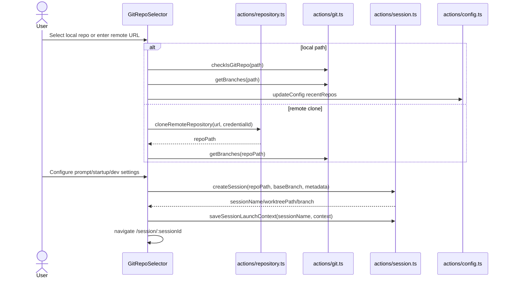

# Repository Onboarding and Selection

## What This Feature Does

User-facing behavior:
- Lets users pick a local repository, browse directories, choose a branch, and start a new session.
- Supports resolving repositories by name and cloning a remote repository into `~/.viba/repos`.
- Stores recent repositories and per-repo settings (agent preferences, startup/dev scripts, credentials).

System-facing behavior:
- Validates local repo paths and git status.
- Reads/writes config and repository metadata.
- Hydrates startup defaults (`npm install`, `npm run dev`) and session launch context.

Primary implementation: [src/components/GitRepoSelector.tsx](../../../src/components/GitRepoSelector.tsx).

## Key Modules and Responsibilities

- `GitRepoSelector` UI orchestration and new-session form state:
- [src/components/GitRepoSelector.tsx](../../../src/components/GitRepoSelector.tsx)
- Path browsing and folder selection modals:
- [src/components/FileBrowser.tsx](../../../src/components/FileBrowser.tsx)
- [src/components/fs-browser.tsx](../../../src/components/fs-browser.tsx)
- Repo/session/draft server actions:
- [src/app/actions/repository.ts](../../../src/app/actions/repository.ts)
- [src/app/actions/git.ts](../../../src/app/actions/git.ts)
- [src/app/actions/session.ts](../../../src/app/actions/session.ts)
- [src/app/actions/draft.ts](../../../src/app/actions/draft.ts)
- [src/app/actions/config.ts](../../../src/app/actions/config.ts)

## Public Interfaces

### Server actions invoked by UI
- `resolveRepositoryByName(repoName)`: fuzzy/scan resolution by repository name ([src/app/actions/repository.ts](../../../src/app/actions/repository.ts)).
- `cloneRemoteRepository(remoteUrl, credentialId)`: clone to `~/.viba/repos/<name>` ([src/app/actions/repository.ts](../../../src/app/actions/repository.ts)).
- `checkIsGitRepo`, `getBranches`, `checkoutBranch`, `getStartupScript`, `getDefaultDevServerScript`: repository bootstrap and branch selection ([src/app/actions/git.ts](../../../src/app/actions/git.ts)).
- `createSession` + `saveSessionLaunchContext`: creates worktree session and startup payload ([src/app/actions/session.ts](../../../src/app/actions/session.ts)).

### Related HTTP APIs
- `GET/POST/PUT/DELETE /api/repos` for repository records ([src/app/api/repos/route.ts](../../../src/app/api/repos/route.ts)).
- `POST /api/repos/clone` for API-based clone flow (used by `useCloneRepository` in older/alternate UI) ([src/app/api/repos/clone/route.ts](../../../src/app/api/repos/clone/route.ts), [src/hooks/use-git.ts](../../../src/hooks/use-git.ts)).
- `GET /api/settings`, `PUT /api/settings` for sidebar/default root settings ([src/app/api/settings/route.ts](../../../src/app/api/settings/route.ts)).

## Data Model and Storage Touches

- `~/.viba/config.json` (`recentRepos`, `repoSettings`, pinned shortcuts): [src/app/actions/config.ts](../../../src/app/actions/config.ts).
- `~/.viba/drafts/*.json` draft session payloads: [src/app/actions/draft.ts](../../../src/app/actions/draft.ts).
- `~/.viba/sessions/*.json` and `~/.viba/session-contexts/*.json`: session creation artifacts: [src/app/actions/session.ts](../../../src/app/actions/session.ts).
- `repos.json` in app-data dir for `/api/repos`: [src/lib/store.ts](../../../src/lib/store.ts).

## Main Control Flow

## Error Handling and Edge Cases

- Non-git directories are rejected unless explicit initialize flow is used (`initializeIfNeeded` in `/api/repos`) ([src/app/api/repos/route.ts](../../../src/app/api/repos/route.ts)).
- Remote clone sanitizes folder names, checks destination emptiness, and redacts secrets from error messages ([src/app/actions/repository.ts](../../../src/app/actions/repository.ts)).
- `GitRepoSelector` retries pending session navigation via sessionStorage key if navigation fails/interrupted ([src/lib/session-navigation.ts](../../../src/lib/session-navigation.ts), [src/components/GitRepoSelector.tsx](../../../src/components/GitRepoSelector.tsx)).
- If CLI install/login prerequisites fail, onboarding halts before session start and renders explicit UI error state ([src/components/GitRepoSelector.tsx](../../../src/components/GitRepoSelector.tsx), [src/app/actions/git.ts](../../../src/app/actions/git.ts)).

## Observability

- Errors logged with `console.error` across action handlers and onboarding component states.
- Session list refresh broadcasts through localStorage + window event (`viba:sessions-updated-at`) ([src/lib/session-updates.ts](../../../src/lib/session-updates.ts)).

## Tests

Coverage is mostly in helper libs used by onboarding:
- repo name/path resolution helpers: [src/lib/path.test.ts](../../../src/lib/path.test.ts), [src/lib/url.test.ts](../../../src/lib/url.test.ts), [src/lib/string-utils.test.ts](../../../src/lib/string-utils.test.ts).
- CLI arg/bootstrap behavior for launcher: [test/bin/viba.test.mjs](../../../test/bin/viba.test.mjs), [src/lib/cli-args.test.ts](../../../src/lib/cli-args.test.ts).

No dedicated component tests currently for `GitRepoSelector` form/flow logic.
