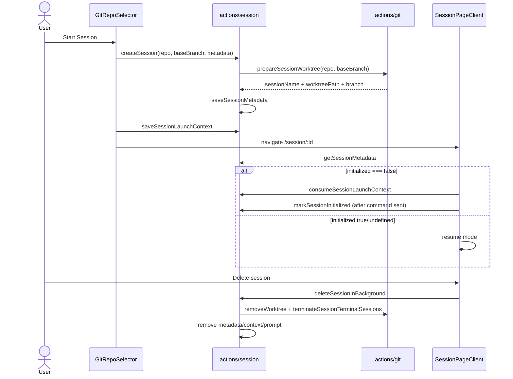

# Session Lifecycle and Worktrees

## What This Feature Does

User-facing behavior:
- Creates isolated coding sessions per task.
- Each session gets its own git worktree + branch.
- Supports session metadata, launch context, prompt persistence, and cleanup.
- Supports merge/rebase back to base branch and base branch reassignment.

System-facing behavior:
- Manages session files in `~/.viba`.
- Coordinates worktree creation/removal and terminal cleanup.

Core implementation: [src/app/actions/session.ts](../../../src/app/actions/session.ts), [src/app/actions/git.ts](../../../src/app/actions/git.ts).

## Key Modules and Responsibilities

- Session action layer:
- metadata/context/prompt read-write
- create/delete/merge/rebase/session divergence
- [src/app/actions/session.ts](../../../src/app/actions/session.ts)
- Worktree creation/removal and tmux session termination:
- [src/app/actions/git.ts](../../../src/app/actions/git.ts)
- Session route loader and first-open semantics:
- [src/app/session/[sessionId]/SessionPageClient.tsx](../../../src/app/session/%5BsessionId%5D/SessionPageClient.tsx)

## Public Interfaces

### Server actions
- `createSession(repoPath, baseBranch, metadata)`.
- `saveSessionLaunchContext`, `consumeSessionLaunchContext`.
- `saveSessionMetadata`, `markSessionInitialized`, `deleteSession`, `deleteSessionInBackground`.
- `mergeSessionToBase`, `rebaseSessionOntoBase`, `getSessionDivergence`, `updateSessionBaseBranch`, `createSessionBaseBranch`.

All from [src/app/actions/session.ts](../../../src/app/actions/session.ts).

### Related git helper actions
- `prepareSessionWorktree`, `removeWorktree`, `terminateSessionTerminalSessions` in [src/app/actions/git.ts](../../../src/app/actions/git.ts).

## Data Model and Storage Touches

- `~/.viba/sessions/<session>.json` (`SessionMetadata`).
- `~/.viba/session-contexts/<session>.json` (`SessionLaunchContext`).
- `~/.viba/session-prompts/<session>.txt` (full prompt passed to codex on first run).
- `~/.viba/drafts/*.json` if user saves a draft before start.

Schemas are defined in [src/app/actions/session.ts](../../../src/app/actions/session.ts) and [src/app/actions/draft.ts](../../../src/app/actions/draft.ts).

## Main Control Flow

## Error Handling and Edge Cases

- Session deletion is intentionally non-blocking with `deleteSessionInBackground`; failures are logged and surfaced in feedback ([src/app/actions/session.ts](../../../src/app/actions/session.ts), [src/components/SessionView.tsx](../../../src/components/SessionView.tsx)).
- Merge/rebase safety checks enforce clean worktree and branch existence before action ([src/app/actions/session.ts](../../../src/app/actions/session.ts)).
- Legacy sessions with missing `initialized` are treated as resume to avoid duplicate startup injection ([src/app/session/[sessionId]/SessionPageClient.tsx](../../../src/app/session/%5BsessionId%5D/SessionPageClient.tsx)).
- Worktree cleanup is best-effort; even critical cleanup errors currently return success to unblock metadata removal path ([src/app/actions/git.ts](../../../src/app/actions/git.ts)).

## Observability

- Lifecycle failures are logged via `console.error` in action handlers and session page loader.
- Session UI shows status/feedback banner messages while running merge/rebase/delete operations ([src/components/SessionView.tsx](../../../src/components/SessionView.tsx)).

## Tests

- No direct session action integration tests in this branch.
- Related helper coverage exists for session navigation state:
- [src/lib/session-navigation.test.ts](../../../src/lib/session-navigation.test.ts).
