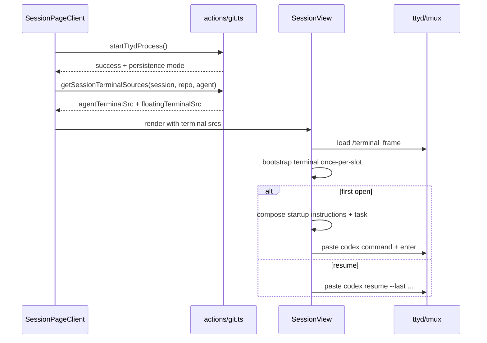

# Terminal Orchestration and Agent Bootstrap

## What This Feature Does

User-facing behavior:
- Provides two web terminals per session:
- agent terminal for Codex interaction
- floating terminal for startup/dev scripts
- Restores/resumes session terminal state across page loads.
- Applies monochrome terminal theme and supports scroll/select interaction modes (tmux-backed mode).

System-facing behavior:
- Starts/reuses global `ttyd` process on port `7681`.
- Uses `tmux` session names derived from session and role when available.
- Injects initial Codex command into terminal on first load or resume.
- Resolves environment variables for git credentials (`GITHUB_TOKEN`/`GITLAB_TOKEN`) and agent API (`OPENAI_API_KEY`, optional `OPENAI_BASE_URL`).

Primary files: [src/components/SessionView.tsx](../../../src/components/SessionView.tsx), [src/app/actions/git.ts](../../../src/app/actions/git.ts), [src/lib/terminal-session.ts](../../../src/lib/terminal-session.ts), [src/lib/ttyd-theme.ts](../../../src/lib/ttyd-theme.ts).

## Key Modules and Responsibilities

- `startTtydProcess()` manages singleton ttyd process and tmux defaults ([src/app/actions/git.ts](../../../src/app/actions/git.ts)).
- `getSessionTerminalSources()` builds role-specific terminal iframe URLs with env arguments ([src/app/actions/git.ts](../../../src/app/actions/git.ts), [src/lib/terminal-session.ts](../../../src/lib/terminal-session.ts)).
- `SessionView` bootstraps terminal iframe, injects Codex command, appends startup instructions, and tracks process state ([src/components/SessionView.tsx](../../../src/components/SessionView.tsx)).
- `applyThemeToTerminalWindow`/`applyThemeToTerminalIframe` apply terminal theme and filter ANSI background control sequences ([src/lib/ttyd-theme.ts](../../../src/lib/ttyd-theme.ts)).

## Public Interfaces

### Server actions
- `startTtydProcess()`.
- `getSessionTerminalSources(sessionName, repoPath, agentCli?)`.
- `setTmuxSessionMouseMode`, `setTmuxSessionStatusVisibility`, `terminateSessionTerminalSessions`.

All in [src/app/actions/git.ts](../../../src/app/actions/git.ts).

### Terminal URL contract
- Built as `/terminal?arg=new-session&arg=-e&arg=KEY=VALUE&arg=-A&arg=-s&arg=<tmuxSession>`.
- Helper: `buildTtydTerminalSrc(sessionName, role, env?)` ([src/lib/terminal-session.ts](../../../src/lib/terminal-session.ts)).

## Data Model and Storage Touches

- Session terminal bootstrap state is tracked in browser sessionStorage/runtime keys (see constants in `SessionView`) ([src/components/SessionView.tsx](../../../src/components/SessionView.tsx)).
- Terminal panel size/split preferences stored in localStorage keys:
- `viba-terminal-size`
- `viba-agent-preview-split-ratio`
- `viba-right-panel-collapsed`
- `viba:theme-mode`

## Main Control Flow

## Error Handling and Edge Cases

- If ttyd is already running, action returns success and re-applies tmux defaults when needed ([src/app/actions/git.ts](../../../src/app/actions/git.ts)).
- On systems without tmux, falls back to non-persistent shell mode (`ttyd ... bash/powershell`) ([src/app/actions/git.ts](../../../src/app/actions/git.ts)).
- Windows path receives fallback terminal source without env injection for tmux args ([src/app/actions/git.ts](../../../src/app/actions/git.ts)).
- Terminal bootstrap uses state guards to avoid duplicate command injection when iframe reloads ([src/components/SessionView.tsx](../../../src/components/SessionView.tsx)).
- Theme application is defensive against iframe/document access failures and missing xterm internals ([src/lib/ttyd-theme.ts](../../../src/lib/ttyd-theme.ts)).

## Observability

- Startup and terminal failures are logged (`console.error` / `console.warn`) and surfaced in UI feedback strings.
- SessionView exposes user feedback for mode toggles, startup, and script injection status.

## Tests

- Terminal URL/provider detection: [src/lib/terminal-session.test.ts](../../../src/lib/terminal-session.test.ts).
- Theme mode resolution + terminal theme application/filtering: [src/lib/ttyd-theme.test.ts](../../../src/lib/ttyd-theme.test.ts).
