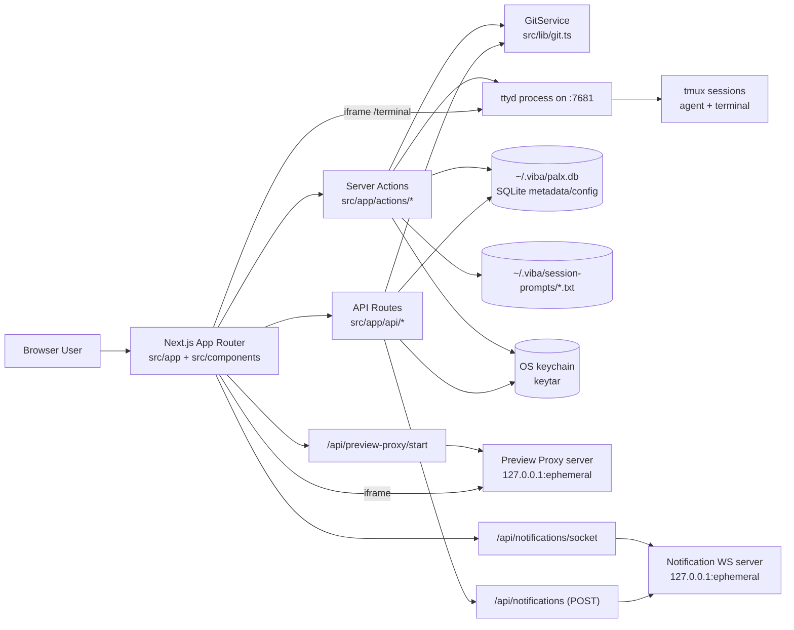
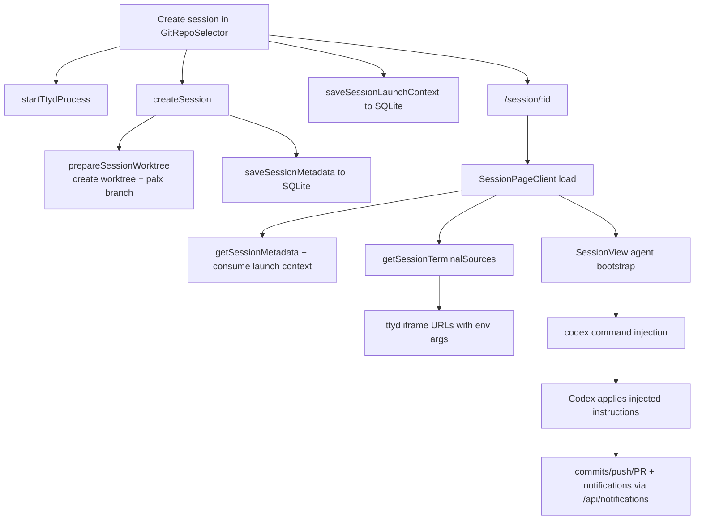

# Architecture

## System Overview

Palx is a local-first Next.js App Router application that manages AI coding sessions using git worktrees and browser terminals.

Core runtime pieces:
- UI and route orchestration: Next.js pages/components ([src/app/page.tsx](../../src/app/page.tsx), [src/components/GitRepoSelector.tsx](../../src/components/GitRepoSelector.tsx), [src/components/SessionView.tsx](../../src/components/SessionView.tsx)).
- Session/worktree lifecycle: server actions around git worktrees and metadata ([src/app/actions/session.ts](../../src/app/actions/session.ts), [src/app/actions/git.ts](../../src/app/actions/git.ts)).
- Git operations service: centralized `GitService` wrapper over `simple-git` ([src/lib/git.ts](../../src/lib/git.ts)).
- Terminal backend: `ttyd` (+ `tmux` when available) launched by app actions and proxied by Next rewrite `/terminal/*` -> `127.0.0.1:7681` ([src/app/actions/git.ts](../../src/app/actions/git.ts), [next.config.mjs](../../next.config.mjs)).
- Local persistence: SQLite database at `~/.viba/palx.db` via [src/lib/local-db.ts](../../src/lib/local-db.ts), with prompt text files in `~/.viba/session-prompts`.
- Credentials: metadata in SQLite + secrets in OS keychain via `keytar` ([src/lib/credentials.ts](../../src/lib/credentials.ts), [src/lib/agent-api-credentials.ts](../../src/lib/agent-api-credentials.ts)).
- Preview tooling and notifications: local proxy and WebSocket side servers ([src/lib/previewProxyServer.ts](../../src/lib/previewProxyServer.ts), [src/lib/sessionNotificationServer.ts](../../src/lib/sessionNotificationServer.ts)).

## High-Level Architecture

## Component Boundaries

### Route + UI layer
- Home/new/session/git routes: [src/app/page.tsx](../../src/app/page.tsx), [src/app/new/page.tsx](../../src/app/new/page.tsx), [src/app/session/[sessionId]/page.tsx](../../src/app/session/%5BsessionId%5D/page.tsx), [src/app/git/layout.tsx](../../src/app/git/layout.tsx).
- Session UI orchestration (terminal bootstrap, prompt injection, preview, cleanup): [src/components/SessionView.tsx](../../src/components/SessionView.tsx).
- Git workspace UI (history/status/stashes/custom scripts): [src/components/git/history-view.tsx](../../src/components/git/history-view.tsx), [src/components/git/status-view.tsx](../../src/components/git/status-view.tsx), [src/app/git/stashes/page.tsx](../../src/app/git/stashes/page.tsx), [src/app/git/custom-scripts/page.tsx](../../src/app/git/custom-scripts/page.tsx).

### Domain + service layer
- Git abstraction and conflict/branch/stash/remote operations: [src/lib/git.ts](../../src/lib/git.ts).
- Terminal URL/provider parsing and tmux session naming: [src/lib/terminal-session.ts](../../src/lib/terminal-session.ts).
- Theme and ANSI filtering for ttyd/xterm rendering: [src/lib/ttyd-theme.ts](../../src/lib/ttyd-theme.ts).
- Preview proxy with HTML script injection and picker bridge: [src/lib/previewProxyServer.ts](../../src/lib/previewProxyServer.ts).
- Session notification WebSocket fanout: [src/lib/sessionNotificationServer.ts](../../src/lib/sessionNotificationServer.ts).

### Persistence + credentials layer
- Local metadata/config DB (`~/.viba/palx.db`) with schema + migration logic: [src/lib/local-db.ts](../../src/lib/local-db.ts).
- Repository/settings store backed by SQLite tables: [src/lib/store.ts](../../src/lib/store.ts).
- App config + per-repo settings backed by SQLite tables: [src/app/actions/config.ts](../../src/app/actions/config.ts).
- Session metadata/context and drafts backed by SQLite, with prompt files kept in `~/.viba/session-prompts`: [src/app/actions/session.ts](../../src/app/actions/session.ts), [src/app/actions/draft.ts](../../src/app/actions/draft.ts).
- Git and agent API credentials with keytar-backed secrets: [src/lib/credentials.ts](../../src/lib/credentials.ts), [src/lib/agent-api-credentials.ts](../../src/lib/agent-api-credentials.ts).

### Security/auth boundary
- Optional Auth0 gate for pages and most APIs via middleware: [src/proxy.ts](../../src/proxy.ts), [src/lib/auth0.ts](../../src/lib/auth0.ts).
- Explicit exception: unauthenticated local notification ingress (`POST /api/notifications`) to allow local agent process posting ([src/proxy.ts](../../src/proxy.ts)).

## Main Data Flows

## Key Runtime Flows

### Request lifecycle (UI + server)
- Client uses React Query hooks to call API routes for git/repo/settings/credentials ([src/hooks/use-git.ts](../../src/hooks/use-git.ts), [src/hooks/use-credentials.ts](../../src/hooks/use-credentials.ts)).
- Mutating operations route through `POST /api/git/action` action dispatcher and then `GitService` methods ([src/app/api/git/action/route.ts](../../src/app/api/git/action/route.ts), [src/lib/git.ts](../../src/lib/git.ts)).

### Session startup lifecycle
- Create session: worktree + `palx/<session>` branch + metadata/context persistence ([src/app/actions/session.ts](../../src/app/actions/session.ts), [src/app/actions/git.ts](../../src/app/actions/git.ts)).
- First-open vs resume is governed by `initialized` flag in session metadata; first open consumes launch context and then marks initialized ([src/app/session/[sessionId]/SessionPageClient.tsx](../../src/app/session/%5BsessionId%5D/SessionPageClient.tsx), [src/app/actions/session.ts](../../src/app/actions/session.ts)).

### Background jobs/events
- Session deletion has background variant (`deleteSessionInBackground`) to avoid client navigation blocking ([src/app/actions/session.ts](../../src/app/actions/session.ts)).
- Notification server manages per-session socket sets and fanout delivery count ([src/lib/sessionNotificationServer.ts](../../src/lib/sessionNotificationServer.ts)).

## Invariants And Gotchas

- Session naming and branch naming format are coupled (`sessionName` timestamp UUID fragment, branch `palx/<sessionName>`) ([src/app/actions/git.ts](../../src/app/actions/git.ts)).
- Git commands are configured non-interactive (`GIT_TERMINAL_PROMPT=0`, batch-mode SSH), so credential misconfiguration fails fast instead of hanging ([src/lib/git.ts](../../src/lib/git.ts)).
- Metadata/config persistence is centralized in SQLite (`~/.viba/palx.db`); session prompts are intentionally separate text files in `~/.viba/session-prompts`.
- SessionView injects operational instructions into Codex command startup for every new run (plan-mode gating, auto-commit/push/PR, skills, notification API payload) ([src/components/SessionView.tsx](../../src/components/SessionView.tsx)).
