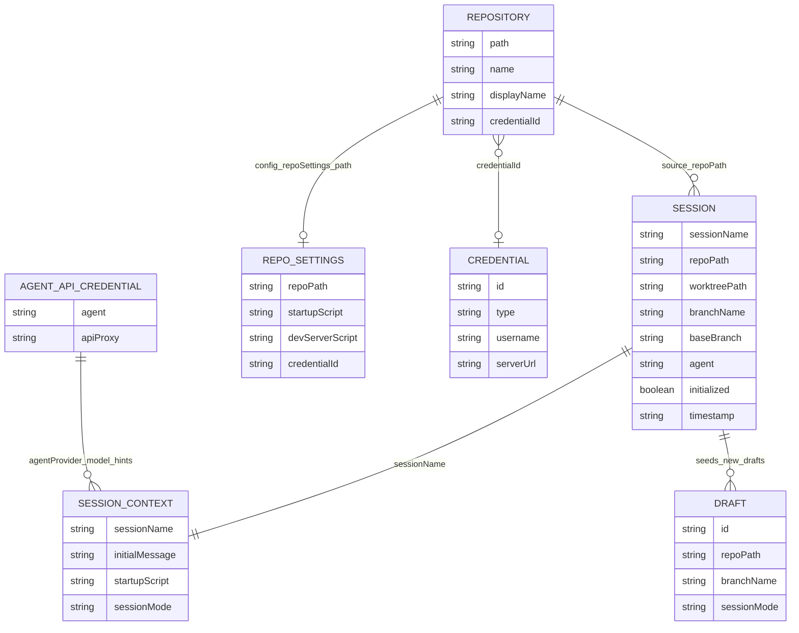

# Data Model

## Persistence Overview

Palx now uses a local SQLite database for metadata/config persistence.

Primary storage location:
- `~/.viba/palx.db` (single-file SQLite database), initialized by [src/lib/local-db.ts](../../src/lib/local-db.ts).

What is persisted in SQLite:
- repository records and UI repository state.
- app settings and app config.
- per-repo settings.
- session metadata and launch context.
- draft metadata.
- git credential metadata.
- agent API credential metadata.

What remains file-based:
- session prompt text files at `~/.viba/session-prompts/*.txt` ([src/app/actions/session.ts](../../src/app/actions/session.ts)).
- repository clones and worktree directories on disk ([src/app/actions/repository.ts](../../src/app/actions/repository.ts), [src/app/actions/git.ts](../../src/app/actions/git.ts)).

Secret material:
- secrets are still stored in OS keychain via `keytar` (tokens/API keys), not in SQLite ([src/lib/credentials.ts](../../src/lib/credentials.ts), [src/lib/agent-api-credentials.ts](../../src/lib/agent-api-credentials.ts)).

## SQLite Schema Groups

Defined in [src/lib/local-db.ts](../../src/lib/local-db.ts).

- Repository/settings tables:
  - `repositories`
  - `app_settings`
- App config tables:
  - `app_config`
  - `app_config_recent_repos`
  - `app_config_pinned_folder_shortcuts`
  - `app_config_repo_settings`
- Credential metadata tables:
  - `credentials_metadata`
  - `agent_api_credentials_metadata`
- Session/draft tables:
  - `sessions`
  - `session_launch_contexts`
  - `drafts`
- Migration/versioning table:
  - `schema_meta`

## Entities and Schemas

### Repository record
Defined in [src/lib/types.ts](../../src/lib/types.ts), persisted by [src/lib/store.ts](../../src/lib/store.ts) into `repositories`.

Key fields:
- `path`, `name`, optional `displayName`
- `lastOpenedAt`
- `credentialId`
- tree visibility/expansion fields (`visibilityMap`, `expandedFolders`, etc.)

### App settings (store)
Defined in [src/lib/types.ts](../../src/lib/types.ts), persisted by [src/lib/store.ts](../../src/lib/store.ts) into `app_settings`.

Key fields:
- `defaultRootFolder`
- `sidebarCollapsed`
- `historyPanelHeight`

### App config
Defined in [src/app/actions/config.ts](../../src/app/actions/config.ts), persisted into:
- `app_config`
- `app_config_recent_repos`
- `app_config_pinned_folder_shortcuts`
- `app_config_repo_settings`

Key fields:
- `recentRepos[]`
- `defaultRoot`
- `selectedIde`
- `agentWidth`
- `repoSettings` map
- `pinnedFolderShortcuts[]`

`repoSettings` entries include:
- `agentProvider`, `agentModel`, `startupScript`, `devServerScript`, `lastBranch`, `credentialId`, `credentialPreference`.

### Session metadata
Defined in [src/app/actions/session.ts](../../src/app/actions/session.ts), persisted in `sessions`.

Key fields:
- `sessionName`
- `repoPath`, `worktreePath`, `branchName`, `baseBranch`
- `agent`, `model`, optional `title`, optional `devServerScript`
- `initialized`
- `timestamp`

### Session launch context
Defined in [src/app/actions/session.ts](../../src/app/actions/session.ts), persisted in `session_launch_contexts`.

Key fields:
- `initialMessage`, `rawInitialMessage`
- `startupScript`
- `attachmentPaths[]`, `attachmentNames[]`
- `agentProvider`, `model`, `sessionMode`, `isResume`

### Draft metadata
Defined in [src/app/actions/draft.ts](../../src/app/actions/draft.ts), persisted in `drafts`.

### Git credential metadata
Defined in [src/lib/credentials.ts](../../src/lib/credentials.ts), persisted in `credentials_metadata`.

Key fields:
- `id`, `type`, `username`, optional `serverUrl`
- timestamps
- optional `keytarAccount`

Secret value (token) is stored in keychain service `viba-git-credentials`.

### Agent API credential metadata
Defined in [src/lib/agent-api-credentials.ts](../../src/lib/agent-api-credentials.ts), persisted in `agent_api_credentials_metadata`.

Secret value (api key) is stored in keychain service `viba-agent-api-credentials`.

## Relationships

## Concurrency and Consistency Notes

- SQLite writes are transactional and centralized through the local DB layer.
- DB is initialized with pragmas for local robustness/performance: WAL mode, foreign keys enabled, busy timeout, and `synchronous=NORMAL` ([src/lib/local-db.ts](../../src/lib/local-db.ts)).
- In-memory global maps are still used for long-lived process state:
  - preview proxy instances (`__vibaPreviewProxyStates`)
  - notification socket state (`__vibaSessionNotificationServerState`)
  - git client instance cache (`gitInstances` in [src/lib/git.ts](../../src/lib/git.ts))

## Indexes and Migrations

- Indexes exist for key query paths (for example `sessions_repo_path_idx`, `sessions_timestamp_idx`, `drafts_repo_path_idx`, `drafts_timestamp_idx`) in [src/lib/local-db.ts](../../src/lib/local-db.ts).
- A one-time legacy migration imports prior JSON-backed metadata into SQLite on first DB initialization (`schema_meta` key `legacy_migration_v1`).
- Legacy JSON files are migration sources only and are no longer the source of truth after migration.

## Gotchas

- Session prompts intentionally remain text files (`~/.viba/session-prompts`), so session persistence is split between SQLite metadata and prompt files.
- Credential metadata may exist without keychain secret if keytar is unavailable or secrets were removed; callers treat missing token as unauthenticated.
