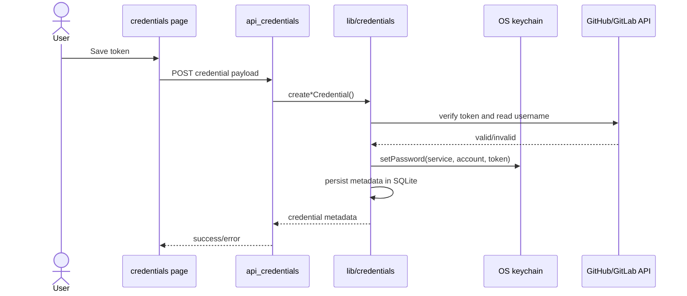

# Credentials and Authentication

## What This Feature Does

User-facing behavior:
- Optional Auth0 login gate for app access.
- Credentials management UI for GitHub/GitLab git tokens and Codex API key/proxy.
- Automatic credential selection for clone/push/pull based on remote provider/host.

System-facing behavior:
- Validates tokens against provider APIs before persistence.
- Stores credential metadata in local SQLite and secrets in OS keychain via `keytar`.
- Injects credential environment variables into ttyd terminal sessions.

## Key Modules and Responsibilities

- Auth0 config and middleware gate:
- [src/lib/auth0.ts](../../../src/lib/auth0.ts)
- [src/proxy.ts](../../../src/proxy.ts)
- Credential persistence and host matching:
- [src/lib/credentials.ts](../../../src/lib/credentials.ts)
- Agent API credential persistence:
- [src/lib/agent-api-credentials.ts](../../../src/lib/agent-api-credentials.ts)
- Credentials page UI:
- [src/app/credentials/page.tsx](../../../src/app/credentials/page.tsx)
- Credentials routes/actions:
- [src/app/api/credentials/route.ts](../../../src/app/api/credentials/route.ts)
- [src/app/api/credentials/github/repos/route.ts](../../../src/app/api/credentials/github/repos/route.ts)
- [src/app/actions/credentials.ts](../../../src/app/actions/credentials.ts)

## Public Interfaces

### Auth interfaces
- Auth routes are handled by `@auth0/nextjs-auth0` middleware integration when required env vars are present ([src/lib/auth0.ts](../../../src/lib/auth0.ts), [src/proxy.ts](../../../src/proxy.ts)).
- For unauthenticated API access, middleware returns `401` JSON except allowed notification ingress `POST /api/notifications`.

### Credential APIs
- `GET /api/credentials`: list metadata.
- `POST /api/credentials`: create `github` or `gitlab` credential.
- `PUT /api/credentials`: rotate token by credential id.
- `DELETE /api/credentials`: remove credential.
- `GET /api/credentials/github/repos?credentialId=...`: list GitHub repos via token.

### Credential server actions
- `saveGitHubCredential`, `saveGitLabCredential`, `removeCredential`.
- `saveAgentApiCredential`, `removeAgentApiCredential`.

All in [src/app/actions/credentials.ts](../../../src/app/actions/credentials.ts).

## Data Model and Storage Touches

- Git credentials metadata: SQLite table `credentials_metadata` in `~/.viba/palx.db`.
- Agent API metadata: SQLite table `agent_api_credentials_metadata` in `~/.viba/palx.db`.
- Secrets: OS keychain using services:
- `viba-git-credentials`
- `viba-agent-api-credentials`

Implementation: [src/lib/credentials.ts](../../../src/lib/credentials.ts), [src/lib/agent-api-credentials.ts](../../../src/lib/agent-api-credentials.ts).

## Main Control Flow

## Error Handling and Edge Cases

- If `keytar` is unavailable, create/update returns explicit secure-storage error and logs a warning once ([src/lib/credentials.ts](../../../src/lib/credentials.ts), [src/lib/agent-api-credentials.ts](../../../src/lib/agent-api-credentials.ts)).
- Duplicate credentials are blocked per host/user combination.
- Clone/push credential matching handles SSH and HTTPS remotes and GitLab host disambiguation ([src/lib/terminal-session.ts](../../../src/lib/terminal-session.ts), [src/lib/credentials.ts](../../../src/lib/credentials.ts), [src/app/actions/repository.ts](../../../src/app/actions/repository.ts)).
- Clone errors sanitize secret values from messages before returning to UI ([src/app/actions/repository.ts](../../../src/app/actions/repository.ts)).
- Home page warns when Auth0 env vars are missing and app runs in unprotected mode ([src/app/page.tsx](../../../src/app/page.tsx)).

## Observability

- Credential and auth failures are logged (`console.error`) and surfaced in API/UI messages.
- Middleware centralizes auth rejections and redirect behavior logs indirectly through Next/Auth0 runtime.

## Tests

No dedicated credential/auth integration tests are present in this branch.
Supporting host parsing/provider detection tests:
- [src/lib/terminal-session.test.ts](../../../src/lib/terminal-session.test.ts).
