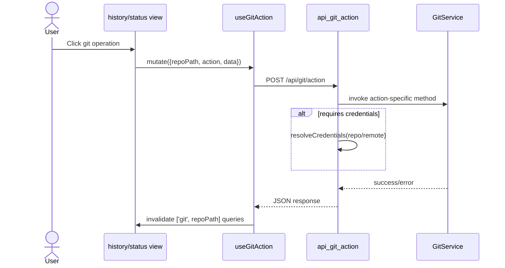

# Git Workspace Operations

## What This Feature Does

User-facing behavior:
- Displays branch graph/history, commit details, file diffs (text and images), status/staging, and stashes.
- Supports local and remote branch management, pull/push, merge/rebase/cherry-pick/reset/revert/reword, conflict resolution, tags/remotes, and lock cleanup.
- Supports auto commit-message generation via Codex when commit message is omitted.

System-facing behavior:
- Centralizes git execution in `GitService` with non-interactive environment.
- Routes most operations through a single API dispatcher (`POST /api/git/action`).

Core files: [src/lib/git.ts](../../../src/lib/git.ts), [src/app/api/git/action/route.ts](../../../src/app/api/git/action/route.ts), [src/components/git/history-view.tsx](../../../src/components/git/history-view.tsx), [src/components/git/status-view.tsx](../../../src/components/git/status-view.tsx), [src/hooks/use-git.ts](../../../src/hooks/use-git.ts).

## Key Modules and Responsibilities

- `GitService`:
- clone/init
- status/log/diff
- branch/tag/remote management
- commit/push/pull/stash/conflict operations
- merge/rebase/cherry-pick/reword
- image/text diff retrieval helpers
- [src/lib/git.ts](../../../src/lib/git.ts)
- API dispatcher and credential resolution:
- [src/app/api/git/action/route.ts](../../../src/app/api/git/action/route.ts)
- Read-only git APIs:
- status: [src/app/api/git/status/route.ts](../../../src/app/api/git/status/route.ts)
- branches: [src/app/api/git/branches/route.ts](../../../src/app/api/git/branches/route.ts)
- log: [src/app/api/git/log/route.ts](../../../src/app/api/git/log/route.ts)
- diff: [src/app/api/git/diff/route.ts](../../../src/app/api/git/diff/route.ts)
- UI + query hooks:
- hooks: [src/hooks/use-git.ts](../../../src/hooks/use-git.ts)
- history/status views: [src/components/git/history-view.tsx](../../../src/components/git/history-view.tsx), [src/components/git/status-view.tsx](../../../src/components/git/status-view.tsx)

## Public Interfaces

### HTTP APIs
- `POST /api/git/action` with `action` enum and optional `data` payload.
- `GET /api/git/status?path=...`
- `GET /api/git/branches?path=...`
- `GET /api/git/log?path=...&limit=...&scope=all|current`
- `GET /api/git/diff?...` (working tree, commit, commit range, file-level, image diff)

Contracts are implemented in [src/app/api/git/action/route.ts](../../../src/app/api/git/action/route.ts), [src/app/api/git/diff/route.ts](../../../src/app/api/git/diff/route.ts), and related route files.

### Auto commit message interface
- On commit with empty message, API invokes `runCodexCliNonInteractive` and expects JSON schema `{ message: string }` ([src/app/api/git/action/route.ts](../../../src/app/api/git/action/route.ts), [src/lib/codex-cli.ts](../../../src/lib/codex-cli.ts)).

## Data Model and Storage Touches

- Uses repository path on disk and live `.git` state (no DB).
- Reads repo credential association from stored repositories (`credentialId`) via [src/lib/store.ts](../../../src/lib/store.ts).
- UI stores branch visibility and group expansion in repository record fields (`visibilityMap`, `expandedFolders`, `localGroupExpanded`, `remotesGroupExpanded`, `worktreesGroupExpanded`) through `/api/repos` updates.

## Main Control Flow

## Error Handling and Edge Cases

- Paths are validated before most API operations; missing path returns `404`/`400` ([src/app/api/git/status/route.ts](../../../src/app/api/git/status/route.ts), [src/app/api/git/log/route.ts](../../../src/app/api/git/log/route.ts)).
- `handleGitError` normalizes Zod and git errors into API responses ([src/lib/api-utils.ts](../../../src/lib/api-utils.ts)).
- Merge/rebase/cherry-pick conflict state can be queried and conflict files resolved via dedicated actions (`get-conflict-state`, `resolve-conflict-file`, continue/abort actions) ([src/app/api/git/action/route.ts](../../../src/app/api/git/action/route.ts), [src/lib/git.ts](../../../src/lib/git.ts)).
- `.git/index.lock` failures are surfaced by hook-level toast with one-click cleanup action (`cleanup-lock-file`) ([src/hooks/use-git.ts](../../../src/hooks/use-git.ts)).
- Diff endpoints support binary/image safety; large text diffs are guarded in UI (`Show Diff Anyway`) ([src/app/api/git/diff/route.ts](../../../src/app/api/git/diff/route.ts), [src/components/git/commit-changes-view.tsx](../../../src/components/git/commit-changes-view.tsx)).

## Observability

- API and service paths use `console.error`/`console.warn` logging for failures.
- UI exposes operation feedback/toasts for success/warnings/failures in history/status views.

## Tests

- Git log option safety: [src/lib/git-log-options.test.ts](../../../src/lib/git-log-options.test.ts).
- Pull-all branch planning utility: [src/components/git/pull-all-utils.test.ts](../../../src/components/git/pull-all-utils.test.ts).
- Diff/theme/path/etc helper tests supporting git UI behavior: [src/lib/url.test.ts](../../../src/lib/url.test.ts), [src/lib/path.test.ts](../../../src/lib/path.test.ts), [src/lib/ttyd-theme.test.ts](../../../src/lib/ttyd-theme.test.ts).

There are currently no end-to-end tests for full history/status user flows in this branch.
