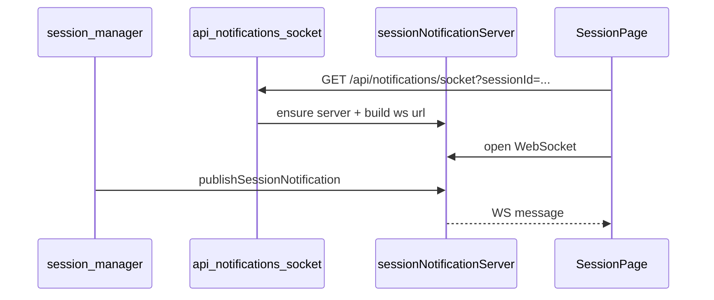

# Notifications and Session Signals

## What This Feature Does

User-facing behavior:
- Routes session notification events to connected session subscribers.
- Keeps session lists synchronized across tabs/windows via local storage event signaling.

System-facing behavior:
- Derives notification payloads from Palx-managed agent runtime state.
- Spins up an in-process WebSocket server and routes notifications by `sessionId`.

## Key Modules and Responsibilities

- Notification WS side server and fanout:
- [src/lib/sessionNotificationServer.ts](../../../src/lib/sessionNotificationServer.ts)
- Runtime-to-notification derivation:
- [src/lib/agent/session-manager.ts](../../../src/lib/agent/session-manager.ts)
- Notification APIs:
- `GET /api/notifications/socket?sessionId=...` ([src/app/api/notifications/socket/route.ts](../../../src/app/api/notifications/socket/route.ts))
- Session page route:
- [src/app/session/[sessionId]/page.tsx](../../../src/app/session/%5BsessionId%5D/page.tsx)
- Tab synchronization helper:
- [src/lib/session-updates.ts](../../../src/lib/session-updates.ts)

## Public Interfaces

### HTTP + WS interfaces
- `GET /api/notifications/socket?sessionId=...`
- Returns JSON with `wsUrl` to connect to.
- WebSocket payload shape:
- `{ type: 'session-notification', sessionId, title, description, timestamp }`

### Browser signaling interface
- `notifySessionsUpdated()` writes `localStorage['viba:sessions-updated-at']` and dispatches `viba:sessions-updated` custom event.

## Data Model and Storage Touches

- Notification subscriptions are in-memory only (`sessionSockets: Map<sessionId, Set<WebSocket>>`).
- Session-update sync uses localStorage key `viba:sessions-updated-at`.

## Main Control Flow

## Error Handling and Edge Cases

- Socket route returns `400` when `sessionId` is missing ([src/app/api/notifications/socket/route.ts](../../../src/app/api/notifications/socket/route.ts)).
- Derived notifications are emitted only for completed turns, auth-required states, and terminal errors.
- When no session subscriber is connected, notification payloads are dropped silently.

## Observability

- Notification delivery count is returned by `publishSessionNotification(...)` to internal callers.
- Undelivered notification payloads do not trigger any OS-level fallback.

## Tests

- Delivery and derivation are covered by unit tests in [src/lib/session-notification-delivery.test.ts](../../../src/lib/session-notification-delivery.test.ts) and [src/lib/session-agent-notifications.test.ts](../../../src/lib/session-agent-notifications.test.ts).
